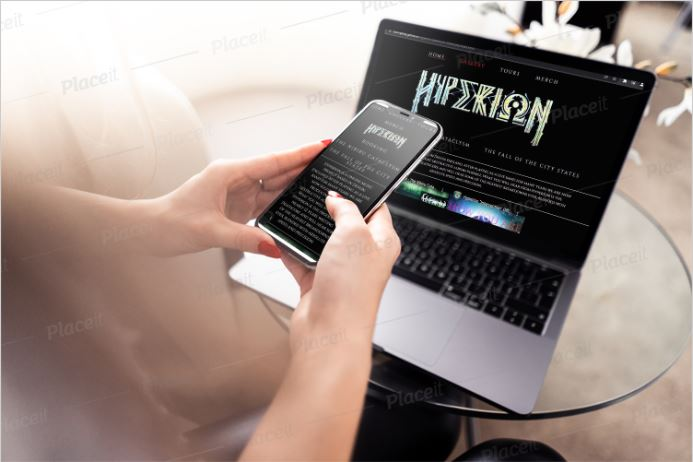
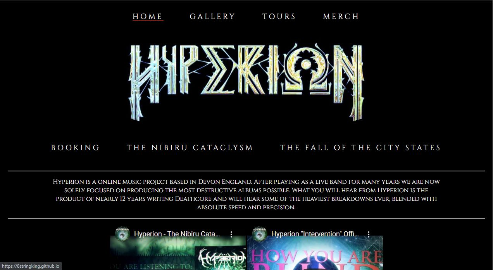
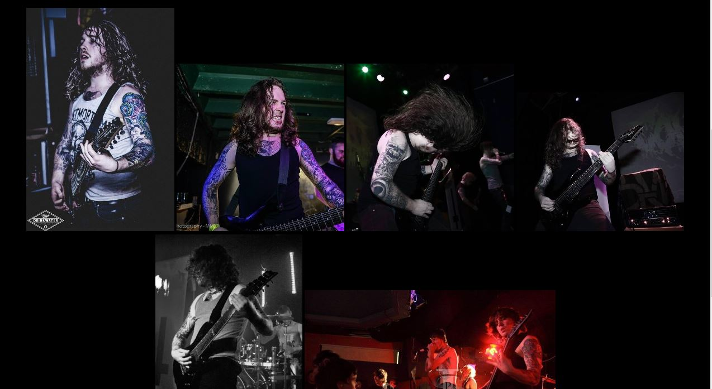
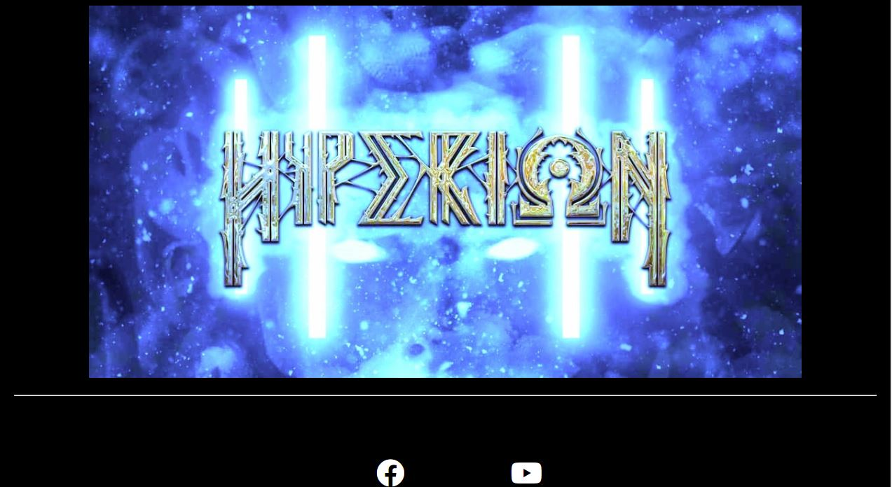
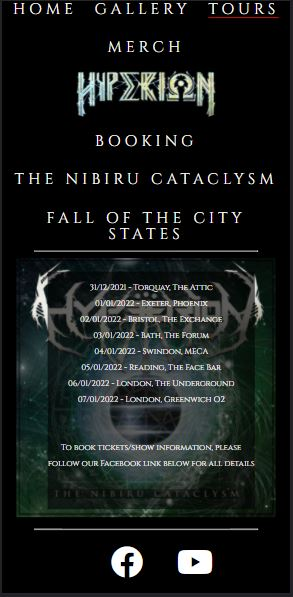
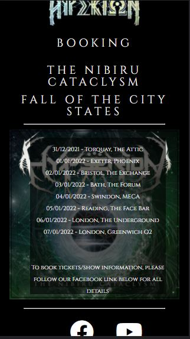
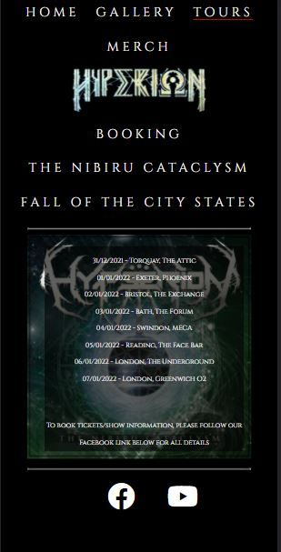
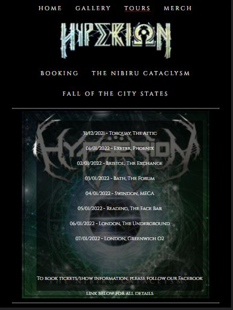
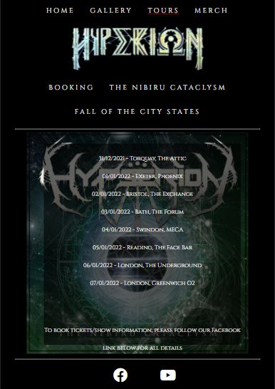
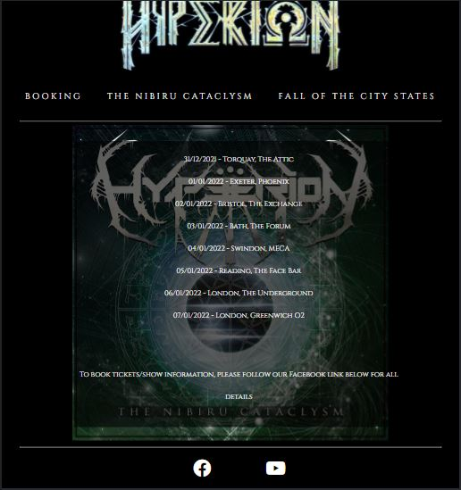

Welcome! to the Hyperion Uk Deathcore website! In this website we will shocase all of our previous releases, such as The Nibiru Cataclysm and showcase all our future upcoming material such as The Fall Of The City States, and more to come in the future. Also this will be the place where you the fans can see even more material first! such as playthrough videos of certain aspects of the band, and gain a key insight into how we make our records what they are, and even show you how we make and mix our songs including STL Tonehub Presets!

The overall aim of this project is to promote and showcase our material to our fans and fans of Heavy Deathcore all around the world! While giving the fans the opportunity to see content here first, before being released on social media, and also show that the South-West is still a great source of Deathcore bands. 

The live website can be found [here](https://8stringking.github.io/Hyperion-Deathcore-Milestone/)
<h2>Live Site Images</h2>

<h1>Index</h1>
<ol>
    <li>User Experience</li>
    <ul>
        <li>What this project is and why</li>
        <li>Target audience</li>
        <li>What the fans can expect</li>
        <li>Web Design</li>
        <li>Wire frames</li>
        <li>Website Walkthrough</li>
    </ul>
    <li>Website features</li>
    <li>Methods for creating the site (html5 css etc)</li>
    <li>Testing</li>
    <li>Bugs</li>
    <li>Future plans and goals for the website</li>
    <li>Deployment</li>
    <li>Refrences </li>
</ol>

<h1>User Experience</h1>

Welcome to the Hyperion website. This website is the hub for Hyperion content before anywhere else, and why weve chosen to do this is to give the fans a more in depth, and personal view of Hyperion rather than a standard Facebook or Instagram layout. We think this does reflect Hyperion in the best way and hope to grow our fanbase using this website. It also gives people the opportunity to book Hyperion for any event rather than using social media messages, as is the standard and sets out clear guidelines from the start.

Weve tailored the design of this website for the fans of heavy music from Deathcore to Djent, and of all ages and all peoples, which is why the website is darker than the average website, and this has been done to capitilize on our eye catching artwork and to really make the content stand out, and to showcase how much artwork has been created for Hyperion.

<h2>What the fans can expect</h2>

The Fans can expect a dark, simple, easy to navigate website packed full of all of our content in one place. No more scrolling through albums on facebook, or never ending scrolling on instagram, its all here and simple to navigate from page to page with a Navigation bar that we believe is stylish and is slightly bigger than your average to give the user the ease of accessing everything instantly.

They can also expect UN-RELEASED previews of our next EP 'Fall of the city states', bands dont typically do this, however we believe that the ability to listen to new songs not released anywhere else is a VITAL part of drawing new fans to us and the website and incredibly exciting for fans also.

<h2>Web design</h2>

The web design of this page has been designed to give the user a simple and meaningful and functional experience, while being relevant towards the fan base hyperion is targeting (fans of heavy music/deathcore). This has been done by making the website quite dark, and having the content very light, causing no contrast issues for the user. The reason behind keeping it simple as stated above is usually fans would scroll through social media pages which arnt always as easy to navigate.

The home page has been used to drive the released album (the nibiru cataclysm) while giving more information on the band and having more of an overview of future material. The gallery page we've used as a timeline, hence the picture layout. The most recent being first and the older pictures last, letting fans see the most recent content first! The tours page weve put the nibiru cataclysm artwork in the background as this is the music mostly the fans would be hearing live. Inkeeping with a simple functional website, the tours page we wanted to simply contain links and use their logos that the fans know most in there countries. We know people are very picky about where they get their merch so laying it out in this fashion we know will be very useful for the user. The booking section does contain alot of sections to fill in, however being a musician for over 12 years i know that this is the information needed to reliably book a band. The nibiru cataclysm page again is kept simple using the eye catching artwork to draw in the user, and includes the full album stream from our youtube channel for instant access to that album. And lastly the Fall of the city states page simply includes new teasers and some of the new artwork that accompanies the new release. With the announcement on the homepage i felt no more was needed to explain this section and let the content stand out as much as possible again for a better user experience. 

<h1>Wire Frames</h1>

    
    
    
    
    
    
    
    

    

    
As you can see from the wireframes in the planning stage, the end result is pretty close, and the only reason this happened is due to the overall visual aspect of the page once I started coding the project. These changes were the track previews on the homepage, and the hyperion artwork, I didnt think it made sense having the track previews at the bottom below artwork and thought it was more user friendly to have the artwork almost act as a sub footer. Other than this i was really happy to be able to keep everything as is.
    

    

<h1>Website Walkthrough</h1>

<h1>Website Features</h1>

The Hyperion website includes a few features including, an animated nav bar, links directly for youtube videos, a fully functional form section, functional audio players for all new tracks and links to merch stores and the bands facebook and youtube channels. Unlike facebook and instagram and youtube (which are the primary source for fans interacting with a band and seeing their content) this website has been designed to have everyone in one place for the user.

The youtube links are done as such that they will play on the same webpage so that they can keep scrolling along that page as they listen to music (facebook/instagram/youtube currently cannot support this function) and the user can immerse themselves within all content on that page

The form section is alot more detailed than most, this is mainly due to in my 10 years playing in bands, and booking shows, this is the minimal information needed for a reliable booking, however we have made sure this is even more accurate by adding a clendar, and a clock for dates and times, and made sure it is viewable on all devices, and the proof it is functional is below.

Audio players are used throughout the site with the ability to scroll within a track, this has been done for releasing unreleased content, especially if you want to re-listen to a particular section within a song, and again so the user can continue to scroll within that page while listening to our tracks

The site contains two forms of clickable links. These are for the merch sites, using pictures for links as we know the target audience will recognise these famous logos and can choose where to get their merch from, this is an important part of driving the sales of merch. These days we know that people dont tend to spend too long viewing anything online at a time so by using these logos helps people make their choice faster and making their experience even better. The second is obviously the social media links, which weve used icons that will load up in seperate tabs so the user can stay where they are on the site.

<h1>Methods for creating the site (html5 css etc)</h1>
<ul>
    <li><a href="https://en.wikipedia.org/wiki/HTML">HTML5</a> (was used for structuring and presenting content of the website)</li>
    <li><a href="https://en.wikipedia.org/wiki/CSS">CSS</a> (used for the styling of the content)</li>
    <li><a href="https://fonts.google.com/">Google Fonts</a> (used for all the font styling within the project, fonts used were Cinzel, and Cinzel decorative with serif used for a backup)</li>
    <li><a href="https://www.bootstrapcdn.com/">Bootstrap</a> (used for the responsive code in the header for multiple devices)</li>
    <li><a href="https://fontawesome.com/">Font Awesome</a> (used for the social media icons)</li>
    <li><a href="https://www.w3schools.com/">W3schools</a> (this was used for the coding of the booking form into two columns, and the nav bar logo)</li>
    <li><a href="https://www.google.co.uk/chrome/?brand=FKPE&gclid=EAIaIQobChMI3q3IpujM9AIVk-vtCh2m9AWjEAAYASAAEgIG-_D_BwE&gclsrc=aw.ds">Chrome</a> (used to debug and test the source code using HTML5 and to test site responsiveness)</li>
    <li><a href="https://github.com/">Github</a> (used to create the repository and store the projects code after pushed from Git)</li>
    <li><a href="https://www.gitpod.io/">Gitpod</a> (used for the editing of code within the project for the site)</li>
    <li><a href="https://placeit.net/">Placeit</a> (was used for the mockup image for multiple devices)</li>
    <li><a href="https://validator.w3.org/">W3C Markup</a> (used for validating the html5 code)</li>
    <li><a href="https://jigsaw.w3.org/css-validator/">Jigsaw Validation</a> (used for validating the CSS code)</li>
    </ul>

<h1>Testing</h1>
<h2>CSS Validation</h2>

 

Above is the CSS validation using <a href="https://jigsaw.w3.org/css-validator/">Jigsaw Validation</a> No errors were found. 

<h2>HTML Validation</h2>
<h3>Home page</h3>

<h3>Gallery</h3>

<h3>Tours</h3>

<h3>Merch</h3>

<h3>Booking</h3>

<h3>The Nibiru Cataclysm</h3>

<h3>Fall Of The City States</h3>

Above is the validation for the HTML code using <a href="https://validator.w3.org/">W3C Markup</a>

<h1>Device Testing/Responsive Design Testing</h1>

Below is images of the tours page on a number of different devices to test and show the website's responsive design. In order, the devices are
 Galaxy S8,Iphone 5,
<ul>
<li>Galaxy S8</li>
<li>iphone 5</li>
<li>Google Pixel 2</li>
<li>Ipad/Ipad Pro</li>
<li>Tablets</li>
<li>Laptops</li>
</ul>

 