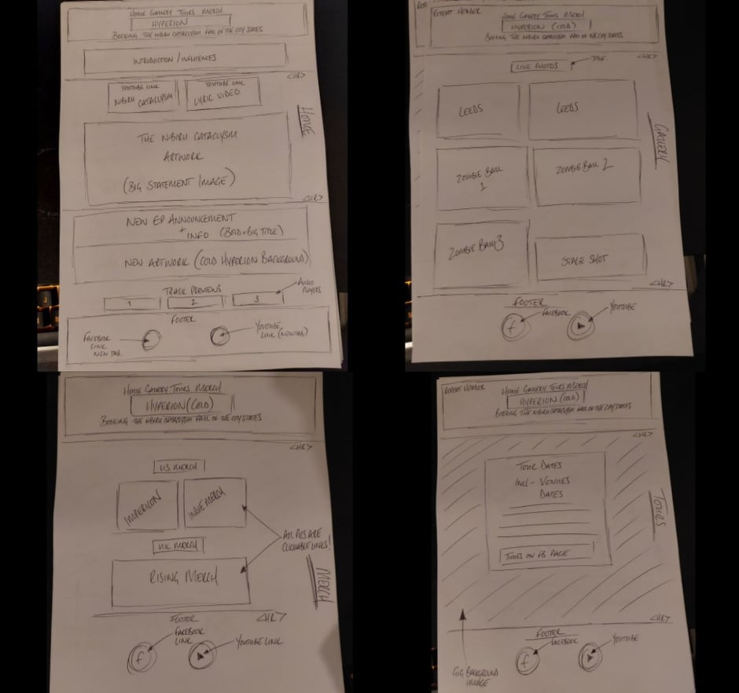
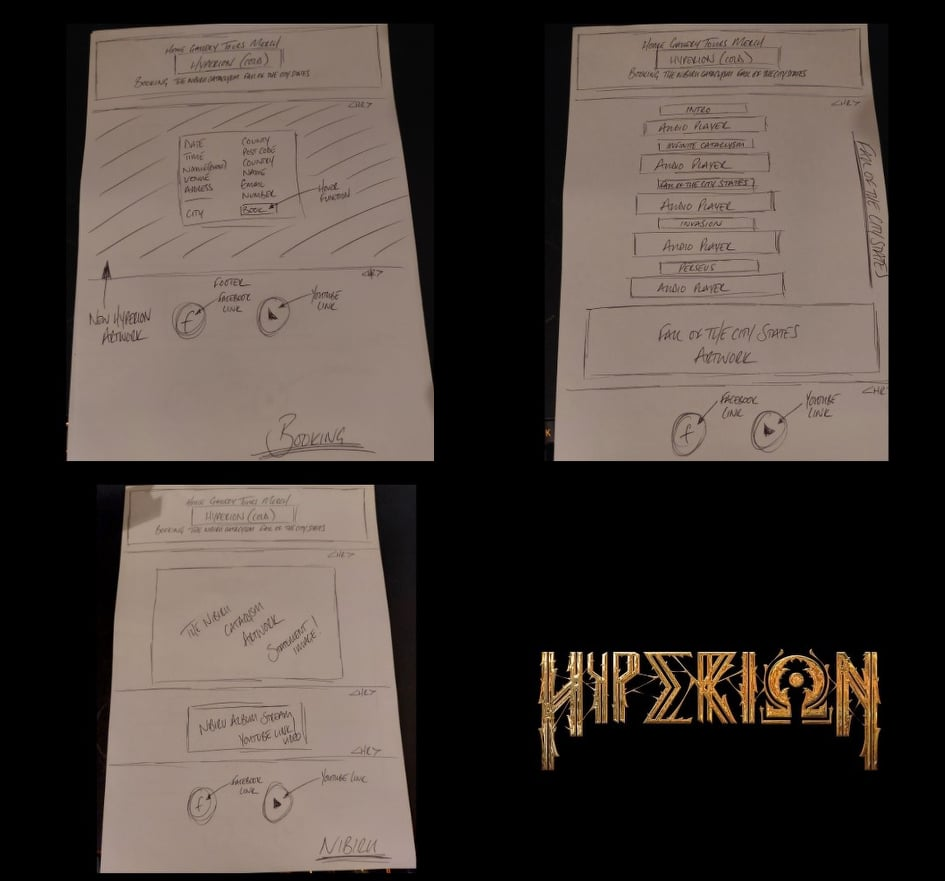

Welcome! to the Hyperion Uk Deathcore website! In this website we will shocase all of our previous releases, such as The Nibiru Cataclysm and showcase all our future upcoming material such as The Fall Of The City States, and more to come in the future. Also this will be the place where you the fans can see even more material first! such as playthrough videos of certain aspects of the band, and gain a key insight into how we make our records what they are, and even show you how we make and mix our songs including STL Tonehub Presets!

The overall aim of this project is to promote and showcase our material to our fans and fans of Heavy Deathcore all around the world! While giving the fans the opportunity to see content here first, before being released on social media, and also show that the South-West is still a great source of Deathcore bands. 

The live website can be found here

Pics of live site!

<h1>Index</h1>
<ol>
    <li>User Experience</li>
    <ul>
        <li>What this project is and why</li>
        <li>Target audience</li>
        <li>What the fans can expect/Web Design</li>
        <li>Wire frames + final images</li>
        <li>Accessibility for everyone (visual readers etc)</li>
    </ul>
    <li>Website features</li>
    <li>Methods for creating the site (html5 css etc)</li>
    <li>Testing</li>
    <li>Bugs</li>
    <li>Future plans and goals for the website</li>
    <li>Deployment</li>
    <li>Refrences </li>
</ol>

<h1>User Experience</h1>

Welcome to the Hyperion website. This website is the hub for Hyperion content before anywhere else, and why weve chosen to do this is to give the fans a more in depth, and personal view of Hyperion rather than a standard Facebook or Instagram layout. We think this does reflect Hyperion in the best way and hope to grow our fanbase using this website. It also gives people the opportunity to book Hyperion for any event rather than using social media messages, as is the standard and sets out clear guidelines from the start.

Weve tailored the design of this website for the fans of heavy music from Deathcore to Djent, and of all ages and all peoples, which is why the website is darker than the average website, and this has been done to capitilize on our eye catching artwork and to really make the content stand out, and to showcase how much artwork has been created for Hyperion.

<h2>What the fans can expect/Web Design</h2>

The Fans can expect a dark, simple, easy to navigate website packed full of all of our content in one place. No more scrolling through albums on facebook, or never ending scrolling on instagram, its all here and simple to navigate from page to page with a Navigation bar that we believe is stylish and is slightly bigger than your average to give the user the ease of accessing everything instantly. They can also expect UN-RELEASED previews of our next EP 'Fall of the city states', bands dont typically do this, however we believe that the ability to listen to new songs not released anywhere else is a VITAL part of drawing new fans to us and the website and incredibly exciting for fans also.

<h1>Wire Frames/Final Images</h1>

    
    

<h1>Accessibility for EVERYONE</h1>

In keeping with the values of the Metal community as a whole, and Hyperions own values. We have made sure in the creation of this website we include everyones needs, which is why our website can be read by visual screen readers for our fans that are visually impaired to make sure no one is left out.
